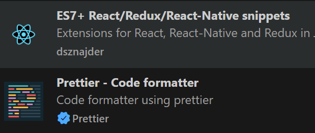

# React

Librería JS para desarrollo de aplicaciones web, especialmente diseñado para aplicaciones SPA y móviles (React Native)

[React](https://https://es.react.dev/)


Características

Las principales características que presenta React:

- Basado en Componentes y su renderizado
- JSX
- DOM Virtual
- Integración con otras librerías (RTK, React Router Dom, ...)

## Diferencias con las alternativas

Existen otras alternativas como:

- Angular
- Vue

Ventajas de React

- Buena curva de aprendizaje
- Muy utilizado
- Reutilización de código
- Utilización de otras librerias

Desventajas React

- Abstracción

Conocimientos Previos

- JS
- Destructuración
- spread Operator
- Módulos, import y export
- Callback y arrow function
- Array y objetos

Entorno de Configuracion y extensiones:



React Developers tools

Comenzar un proyecto:

Vite como herramienta de compilación.

### `npm create vite@latest my-app`

Runs the app in the development mode.
Open [http://localhost:3000](http://localhost:3000) to view it in your browser.

The page will reload when you make changes.
You may also see any lint errors in the console.

Con CTRL+C cerramos el servidor, si queremos volver a ejecutar el servidor

### `npm run dev`

Launches the test runner in the interactive watch mode.
See the section about [running tests](https://facebook.github.io/create-react-app/docs/running-tests) for more information.

### `npm run build`

Builds the app for production to the `build` folder.
It correctly bundles React in production mode and optimizes the build for the best performance.

The build is minified and the filenames include the hashes.
Your app is ready to be deployed!

See the section about [deployment](https://facebook.github.io/create-react-app/docs/deployment) for more information.

### `npm run eject`

**Note: this is a one-way operation. Once you `eject`, you can't go back!**

If you aren't satisfied with the build tool and configuration choices, you can `eject` at any time. This command will remove the single build dependency from your project.

Instead, it will copy all the configuration files and the transitive dependencies (webpack, Babel, ESLint, etc) right into your project so you have full control over them. All of the commands except `eject` will still work, but they will point to the copied scripts so you can tweak them. At this point you're on your own.

You don't have to ever use `eject`. The curated feature set is suitable for small and middle deployments, and you shouldn't feel obligated to use this feature. However we understand that this tool wouldn't be useful if you couldn't customize it when you are ready for it.

## Componentes funcionales

Existen dos tipos de componentes en React, componentes de clase (ya no se utilizan) y componentes funcionales. El componente permite unificar en el mismo elemento la lógica, el layout, y css (style). Un componente funcional en React es una función js que devuelve un JSX:

```
import React from "react";

export default function Card({ producto, pvp }) {
  return (
    <li>
      Card {producto} {pvp}
    </li>
  );
}
```

Esta función recibe por parametro todos los atributos del tag en un objeto
llamado props. Utilizamos **destructuración **para quedarnos con un atributo concreto.

Podemos utilizar ese componente de la siguiente forma:

```
<Card producto="nombre del producto" pvp="11" />
```

Un atributo especial es el atributo **children**, que contendrá el hijo del componente. Incluso podemos pasar un JSX como hijo.

```
function Card({ children }) {
  return (
    <div className="card">
      {children}
    </div>
  );
}
```

## JSX

JSX te permite escribir marcas similares a HTML dentro de un archivo JavaScript, manteniendo la lógica de renderizado y el contenido en el mismo lugar.

JSX aunque es muy similar a html, se distingue de este en:

- Devuelve un sólo elemento raíz
- Cierra todas las etiquetas
- Utiliza camel case en la mayoría de las cosas: className

Debemos tener presente que el jsx se transformará en js, podemos ver con babel online dicha transformación: [https://babeljs.io/repl](https://https://babeljs.io/repl)

En caso de disponer de un html, podemos usar un transformador para transformarlo en jsx : [https://transform.tools/html-to-jsx](https://https://transform.tools/html-to-jsx)

](https://transform.tools/html-to-jsx)

## Renderizado Condicional

Nos permitirá renderizar el componente de distinta forma dependiendo de cierta lógica.

```
if (isPacked) {
  return <li className="item">{name} ✅</li>;
}
return <li className="item">{name}</li>;
```

Utilizando el operador ?, podemos reescribirlo:

```
return (
  <li className="item">
    {isPacked ? name + ' ✅' : name}
  </li>
);
```

o utilizando el operador && {name} {isPacked && '✅'}

## Listas

La forma más habitual de renderizar es listas es utilizar el map (_repasar las arrow function y recordad que si utilizadmos {} para especificar un bloque no estará implicito el return_), del método array, para trasnformar los objetos del array en elementos jsx, suponiendo de productos es un array de objetos, usariamos algo como lo siguiente:

```
return (
    <div>
      ProductoGrid
      <ul className={styles.contenedor}>
        {productos.map((producto) => (
          <ProductoCard producto={producto}  />
        ))}
      </ul>
    </div>
  );
```

Es importante apreciar que react, requiere que cada elemento de la lista disponga de una **key distinta**, para identificar cada componente.

## Estilos


Existen varias formas de aplicar estilos en react

* Estilos en línea
* Hojas de estilo CSS
* Módulos CSS


This section has moved here: [https://facebook.github.io/create-react-app/docs/advanced-configuration](https://facebook.github.io/create-react-app/docs/advanced-configuration)

## Interactividad, eventos

This section has moved here: [https://facebook.github.io/create-react-app/docs/deployment](https://facebook.github.io/create-react-app/docs/deployment)

## Estado

#### Objetos y arrays en el estado

### `npm run build` fails to minify

This section has moved here: [https://facebook.github.io/create-react-app/docs/troubleshooting#npm-run-build-fails-to-minify](https://facebook.github.io/create-react-app/docs/troubleshooting#npm-run-build-fails-to-minify)
